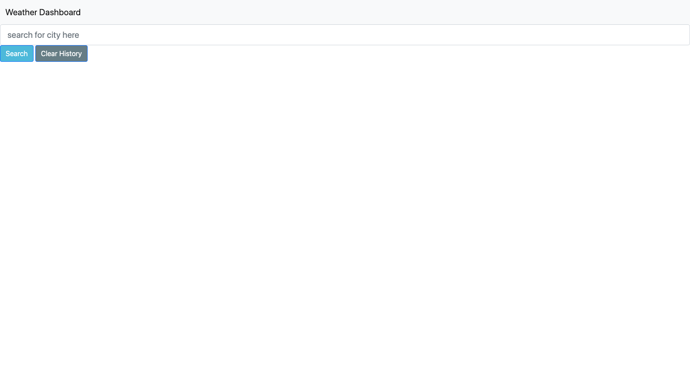

# README

## About

The purpose of this assignment was to create a weather forecast dashboard using an open-source weather API, allowing the user to search for a city, view that city's 5-day weather forecast, and see a list of recently searched cities. 

Please note that the dashboard is still a work-in-progress. 

## Installation

N/A

## Screenshot

## Deployed Website

You can visit the deployed work-in-progress dashboard [here]().

## License

Please see the license included in the repo. 

## Contributions

Quite a few tutorials and other resources were used as guides to write the code for this dashboard:

*[jQuery CheatSheet](https://htmlcheatsheet.com/jquery/)
*[MDN Web Docs: Storage.clear()](https://developer.mozilla.org/en-US/docs/Web/API/Storage/clear)
*[StackOverflow post on appending list item through loop in jQuery](https://stackoverflow.com/questions/37790228/append-a-list-item-through-loop-in-jquery)
*[TutorialRepublic guide on using jQuery .append()](https://www.tutorialrepublic.com/faq/how-to-add-li-in-an-existing-ul-using-jquery.php)
*[Medium.com user-created guide on saving input to localStorage and listing it in table ](https://medium.com/@umar66655/store-user-input-into-localstorage-and-create-the-table-into-another-page-using-javascript-abcb55202cd4)
*[W3Schools page on JS for in loops](https://www.w3schools.com/js/js_loop_forin.asp)
*[folkstalk.com tutorial on pushing user input to array](https://www.folkstalk.com/tech/push-input-value-to-array-javascript-with-code-examples/)

